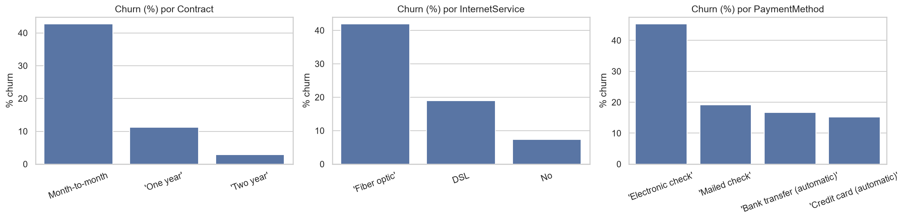
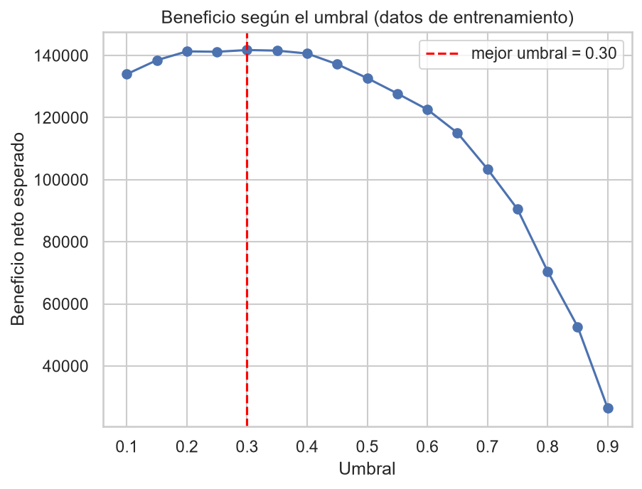

# Predicción de churn en telecomunicaciones

Modelo de machine learning que identifica qué clientes de una empresa de telecomunicaciones tienen más probabilidad de abandonar el servicio, para que el equipo de retención actúe antes de perderlos.

**Stack:** Python · pandas · scikit-learn · matplotlib · seaborn · pytest

## El problema

Una empresa pierde clientes cada mes. Contactar a todos con una oferta de retención es caro, y contactar a pocos deja escapar abandonos evitables. El objetivo es **ordenar a los clientes por riesgo** y decidir a cuántos contactar según el costo de la oferta.

**Datos:** [IBM Telco Customer Churn](https://www.openml.org/d/42178) (OpenML): 7,043 clientes, 19 variables predictoras y la variable objetivo `Churn`. El 26.5% de los clientes abandonó, un desbalance de aproximadamente 3 a 1.

## Hallazgos del análisis exploratorio



- **El contrato es el factor más fuerte.** Churn de 42.7% con contrato mensual, 11.3% con uno de un año y 2.8% con uno de dos años. El segmento mensual agrupa a 3,875 clientes.
- **Los primeros meses son críticos.** Churn de 52.9% en clientes con 0 a 6 meses de antigüedad y de 9.5% con más de 4 años.
- **Fibra óptica, pago con cheque electrónico y ausencia de soporte técnico** se asocian con mayor abandono (~42%, ~45% y ~41% respectivamente).
- **Los clientes que se van pagan más al mes** (mediana de ~80 frente a ~64).

Son asociaciones, no causas: muchas de estas variables están relacionadas entre sí.

## Decisiones de limpieza

- `TotalCharges` venía como texto. Sus 11 valores vacíos corresponden a clientes con `tenure = 0` (aún sin facturar), por lo que se imputaron con 0 en lugar de eliminarlos. El código falla si aparecen vacíos en clientes con antigüedad mayor.
- Se eliminaron comillas literales en las categorías (por ejemplo `'One year'`).
- Se detectaron 22 filas duplicadas (0.3%) y se conservaron: el dataset no tiene identificador de cliente, así que pueden ser clientes distintos con el mismo perfil.

## Modelado

| Paso | Decisión |
|---|---|
| Partición | 80% entrenamiento y 20% prueba, estratificada por `Churn` |
| Preprocesamiento | `Pipeline` con escalado y one-hot ajustados solo con datos de entrenamiento (evita fuga de datos) |
| Modelos | Baseline, regresión logística y random forest, con `class_weight="balanced"` |
| Selección | Validación cruzada de 5 particiones sobre entrenamiento |
| Umbral | Elegido con probabilidades *out-of-fold* de entrenamiento y un costo de negocio |
| Test | Se usa una sola vez, para la confirmación final |

### Resultados

La regresión logística y el random forest rinden igual: la diferencia de AUC (0.848 frente a 0.845) es menor que la desviación entre particiones (0.011). Se eligió la **regresión logística** por simplicidad e interpretabilidad.

| Modelo (test, umbral 0.50) | Accuracy | Precision | Recall | AUC |
|---|---|---|---|---|
| Baseline (siempre "se queda") | 0.735 | 0.000 | 0.000 | 0.500 |
| Regresión logística | 0.739 | 0.505 | 0.802 | 0.845 |
| Random forest | 0.762 | 0.536 | 0.775 | 0.842 |

La accuracy del baseline es casi igual a la del modelo sin detectar un solo abandono, por eso **no se usa como métrica principal**: se priorizan recall, precision y AUC.

### El umbral depende del costo de actuar



Con supuestos hipotéticos (valor del cliente 300, oferta que retiene al 50%):

| Costo de la oferta | Mejor umbral | Clientes a contactar |
|---|---|---|
| 20 | 0.30 | 56.7% |
| 50 | 0.60 | 33.0% |
| 100 | 0.85 | 9.9% |

Con el umbral 0.30 el modelo detecta al **92.5% de los clientes que se van** (precision 43.2% frente a un churn base de 26.5%), a costa de más falsas alarmas (accuracy 65.8%). En un caso real, los costos los daría el área de negocio.

### Variables más relevantes

La antigüedad, el tipo de internet (la fibra eleva el riesgo) y el contrato, en línea con el análisis exploratorio. Varias variables están muy correlacionadas (`TotalCharges` y `tenure`: 0.83; `MonthlyCharges` y `tiene_internet`: 0.76), por lo que los coeficientes individuales no deben interpretarse de forma aislada.

## Limitaciones

- Los costos de la oferta, el valor del cliente y la tasa de retención son hipotéticos.
- Las puntuaciones del modelo no están calibradas (por `class_weight="balanced"`): sirven para ordenar clientes, no como probabilidades reales.
- Los datos no incluyen la causa de salida, la ubicación ni la fecha, así que no se puede evaluar el comportamiento en el tiempo ni hablar de causalidad.

## Estructura del proyecto

```
proyecto_ml/
├── data/
│   ├── raw/            # datos crudos (se descargan, no se versionan)
│   └── processed/      # datos limpios (se generan)
├── notebooks/
│   ├── 01_exploracion.ipynb
│   ├── 02_limpieza.ipynb
│   └── 03_modelado.ipynb
├── src/
│   ├── data.py         # descarga, carga y limpieza
│   ├── features.py     # variables nuevas y preprocesador
│   ├── train.py        # entrenamiento y validación cruzada
│   └── evaluate.py     # métricas, umbrales y beneficio
├── models/             # modelos entrenados (no se versionan)
├── tests/              # 25 pruebas con pytest
├── pytest.ini
└── requirements.txt
```

## Cómo reproducirlo

```bash
git clone https://github.com/TU_USUARIO/proyecto_ml.git
cd proyecto_ml
python -m venv .venv

# Windows (PowerShell)
.venv\Scripts\Activate.ps1
# Linux / macOS
source .venv/bin/activate

pip install -r requirements.txt
python -m src.data      # descarga y limpia los datos
pytest                  # ejecuta las pruebas
```

Luego ejecuta los notebooks en orden (01, 02, 03). Los datos no se incluyen en el repositorio: se descargan de OpenML con el comando anterior.

## Autor

**Tu Nombre** · [LinkedIn](https://www.linkedin.com/in/oscar-fernando-loaiza-medina-3495ba269/) · [GitHub](https://github.com/oscarLoaizaVillavicencio)